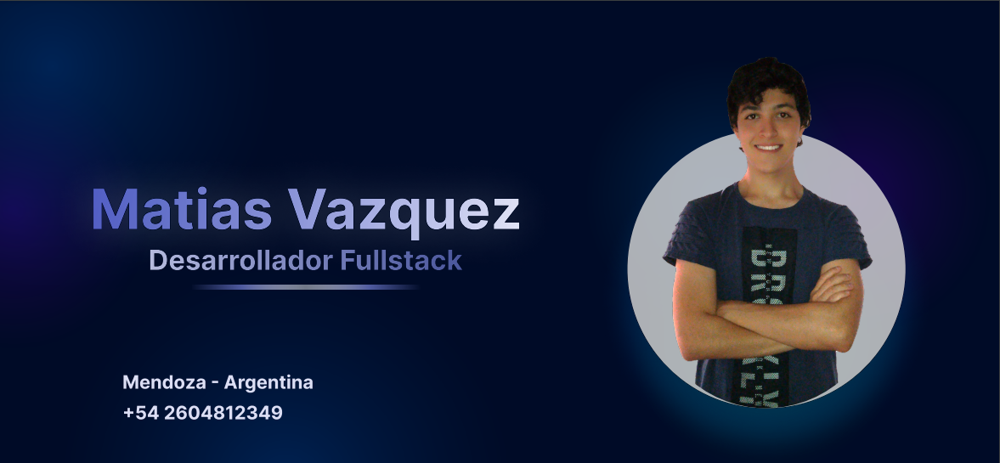

  
 

<h3 align="center">Ey! Hola 👋</h3>
<h1 align="center">Soy Matias Vazquez 😃</h1>

<h2>🌐 Sobre mi...</h2>

Hola 😃! Mi nombre es Matias Vazquez, soy Desarrollador Web Fullstack y actualmente también, estudiante de Ingeniería en Sistemas de Información. 
Hace un par de meses, tomé la decisión de iniciar un Bootcamp de Programación, el cual me permitió mejorar y tener más experiencia con Javascript, HTML, CSS, React, Redux, Express, entre otras tecnologías. 
Tuve la oportunidad de participar en proyectos que me permitieron experimentar y mejorar Habilidades Blandas como el Trabajo en Equipo, Adaptabilidad, Liderazgo, Perseverancia, etc. 
Soy una persona que no tiene en sus planes rendirse; Logro aprender de mis errores, y a pesar de todos los obstáculos y caídas, siempre busco la forma de volverme a levantar con mucho optimismo y esfuerzo para seguir adelante. 
Me apasiona seguir aprendiendo y creciendo tanto personal como profesionalmente. Desde niño me encantó la tecnología, me asombra lo todo lo que puede lograrse con su uso, lo cual, me lleva a tener una gran variedad de proyectos en mente para dejar un buen impacto en el ámbito social y natural. 
Cuento con la pasión, motivación, energía, positividad, compromiso y mucho más para poder dar lo mejor de mí y desarrollarme de la mejor manera en la industria. 
En estos momentos estoy en busca de poder desempeñar mis conocimientos en el mundo real y comenzar a dar vida a los proyectos que alguna vez soñé. 
No duden en contactarme! 
✉️ mativazquez-29@outlook.com 
📞 +54 2604812349

<h2>🌐 Que hago? </h2>

Actualmente estoy trabajando en proyectos pequeños, investigando, estudiando, aprendiendo día a día para mejorar mis habilidades y conocimientos para poder brindar mis servicios de la mejor manera.

<h2>🌐 Tecnologías </h2>

Actualmente estoy usando / aprendiendo, las siguientes tecnologías... 

<table align="center">
  
  <tr>
   <td>
    
  </td>
   <td>
    
  </td>
   <td>
    
  </td>
  <td>
    
  </td>
  <td>
    
  </td>
   <td>
    
  </td>
  </tr>
  
   <tr>
   <td>
    
  </td>
   <td>
    
  </td>
   <td>
    
  </td>
   <td>
    
  </td>
   <td>
    
  </td>
  </tr>
  
</table>

  

<h3>Otras herramientas... </h3>
<table align="center">
  <tr>
    <td>
      
    </td>
    <td>
      
    </td>
  </tr>
</table>

<!--EMOJIS QUE QUIZAS PUEDA LLEGAR A UTILIZAR 💠❌🎶🔴🟠🟡🟢🔵🟣⚫⚪🟤🔸🔹🔷🔲🔳🇦🇷🏕️⛺🎮🎸🐶🐎🦁😎🤩🥳😂😃👾🤖🙌🤝-->
